  
  
  

## Building digital products, end to end

I turn ambitious ideas into fast, reliable, and thoughtfully designed products. My work brings together product strategy, interface design, full-stack engineering, automation, and deployment—so every project moves from concept to a real, usable experience.

- **Product engineering** — business goals translated into maintainable software
- **Experience quality** — responsive, accessible, and visually consistent interfaces
- **Full-stack ownership** — data models, APIs, authentication, admin systems, and deployment
- **Growth infrastructure** — SEO, analytics, CRM, content systems, and practical AI automation

## Selected work

<table>
  <tr>
    <td width="50%" valign="top">
      <h3>Jasmine Proje Pazarlama</h3>
      
Production-focused real-estate platform with CRM, CMS, authentication, analytics, SEO, PWA capabilities, and marketing automation.

      

        
        
        
      

      <a href="https://jpp-ufeb.vercel.app"><b>Live experience ↗</b></a>
      &nbsp;·&nbsp;
      <a href="https://github.com/efeerenakar0/jpp"><b>Source ↗</b></a>
    </td>
    <td width="50%" valign="top">
      <h3>Jasmine Group</h3>
      
Bilingual property platform with listings, editorial guides, regional content, an administration layer, and a live deployment.

      

        
        
        
      

      <a href="https://jasmine-group.vercel.app"><b>Live experience ↗</b></a>
      &nbsp;·&nbsp;
      <a href="https://github.com/efeerenakar0/jasmine-group"><b>Source ↗</b></a>
    </td>
  </tr>
  <tr>
    <td width="50%" valign="top">
      <h3>THREON Store</h3>
      
Multi-page fashion commerce experience with product management, PWA support, and a capable administration interface.

      

        
        
        
      

      <a href="https://github.com/efeerenakar0/ff"><b>Explore source ↗</b></a>
    </td>
    <td width="50%" valign="top">
      <h3>Roma Villa</h3>
      
Luxury villa experience engineered as a full-stack TypeScript application with a modern Cloudflare-ready architecture.

      

        
        
        
      

      <a href="https://github.com/efeerenakar0/Rom-Villa---Bekta-"><b>Explore source ↗</b></a>
    </td>
  </tr>
</table>

## Technology landscape

  

| Frontend | Backend & Data | Product & Delivery |
|:---:|:---:|:---:|
| Next.js · React · TypeScript | Node.js · Prisma · PostgreSQL | UX · SEO · Analytics |
| Tailwind CSS · Responsive UI | Supabase · REST APIs · Auth | CI/CD · PWA · Automation |
| Accessibility · Design Systems | Cloudflare · Data Modeling | Vercel · GitHub Actions · AI |

### Architecture in motion

## Engineering signal

 

## Contribution flow

<picture>
  <source media="(prefers-color-scheme: dark)" srcset="./assets/contribution-snake-dark.svg" />
  <source media="(prefers-color-scheme: light)" srcset="./assets/contribution-snake.svg" />
  
</picture>

Generated automatically from my GitHub contribution graph.

## Let’s build something valuable

I’m interested in product-focused collaborations where design quality, technical depth, and measurable business value belong in the same conversation.

### Have an ambitious idea?

 

Designed and engineered with intention by Efe Eren Akar.

